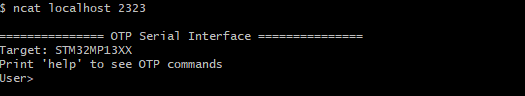

# STM32PRGFW-UTIL Firmware utility to manage One-Time Programmable (OTP) memories
## Project overview

**STM32PRGFW-UTIL** package  provides embedded SW applications to manage the One-Time Programmable (OTP) memories on **STM32MP13xx, STM3MP15xx  devices** as described in the following [wiki page](https://wiki.st.com/stm32mpu/wiki/STM32CubeProgrammer_OTP_management)

It is alternative to the use of U-Boot embedded SW package described in article [How to fuse OTP↑](https://wiki.st.com/stm32mpu/wiki/STM32CubeProgrammer#How_to_fuse_STM32MP15x_OTP) but of course U-Boot services are still available.

This Utility could be usefull during bring-up phase to modify OTP when ecosystem Software (U-Boot in particular) is not ready yet. Indeed, this STM32PRGFW-UTIL firmware is DDR independant ; thus it is ready to use in most of cases for your own design.  This package includes only source code required to support UART and USB DFU protocol  and OTP programming without more complex software, so it could be also easily adapt and improve for your own needs.

This package contains several "Modes" (CP_Serial_Boot, Console_SH..) that you can use with **Windows® or Linux®host PC**. Please find below the more appropriated mode depending on your setup. ""How to"" for each mode is described below into this document.

| Major Use cases / Setup                                                                                                                                                  | CP_Serial_boot<br />(Preferred) |                         Console_SH                         |                                             Console_UART                                             | CP_Dev_Boot |
| ------------------------------------------------------------------------------------------------------------------------------------------------------------------------ | :-----------------------------: | :--------------------------------------------------------: | :---------------------------------------------------------------------------------------------------: | :---------: |
| * Board with USB DFU or UART serial if<br />*[ STM32CubeProgrammer](https://wiki.st.com/stm32mpu/wiki/STM32CubeProgrammer_release_note) PC tool installed (v1.12.0 minimum) |                X                |                                                            |                                                                                                      |            |
| * Board with Debug port<br />* [STM32CubeIDE](https://wiki.st.com/stm32mpu/wiki/STM32CubeIDE_release_note) PC tool installed (v1.11.0 minimum)                              |                                | X<br />Note: KO on Windows PC<br />Partially supported (*) |                                                                                                      |            |
| * Board with Debug port and 1 UART interface<br />* Semihosting (Terminal I/O through debug port)<br /> NOT available on PC                                            |                                |                                                            | X<br />Note: need to<br />modify UART<br />instance in source code <br />if different from ST boards |            |
| * Need to debug your own tool based on this package                                                                                                                     |                                |                                                            |                                                                                                      |      X      |

The functional chart of the project describing all applications mentioned above:


## Repository structure

The **STM32PRGFW-UTIL** repository consists of the following repositories:

- **Drivers**: It contains HAL/LL component per serie and CMSIS Device source code. You can notice there is no BSP as this package is board independent.
- **Middlewares**: It contains OpenBL and USB device library core source code modified for MPU protocols.
- **Projects**: Project directory. It contains 1 STM32CubeIDE project per serie and 1 common project containing source code common to the different projects.

The project structure is described as below:


## How to Use CP_Serial_Boot

In this section, you will  use "Binary" directory  containing a STM32PRGFW-UTIL binary and a tsv file used by STM32CubeProgrammer.

### Hardware prerequisites

* Set boot boot pins  to b000 (BOOT0/1/2 to OFF) position to select **[serial boot](https://wiki.st.com/stm32mpu/wiki/STM32_MPU_ROM_code_overview#Boot_device_selection)**
* If you want to use USB DFU interface

  * connect USB cable bewten PC and the board. PC shoud test USB DFU interface
* else if you want to use UART interface

  * connect UART cable between PC and the board
    * Note: could be STLink connector if Virtal COM port is connected on  the board like ST DK boards
  * **!!! NOTE: USB cable should not be connected if you want to use UART !!! - ROM CODE wil USB DFU if both interface are available!**
  * !!! NOTE

### STM32CubeProgrammer GUI interface

Please Read STM32CubeProgrammer user manual for further details if needed

* Select Port (USB or UART) depending on the choice you made
* Click on Connect button - STM32CubeProgrammer is now connected to ROM Code
* Select TSV `<Your Directory Path>\`Projects\\`<STM32 device>`\Binary\FlashLayout_STM32PRGFW_UTIL.tsv
* Select Binary Path with Browse Button  `<Your Directory Path>\`Projects\\`<STM32 device>`\Binary\
* Click on Download - STM32CubeProgrammer is now connected to STM32PRGFW-UTIL firmware


* Click on OTP button to get OTP Panel


### STM32CubeProgrammer CLI interface

Please Read STM32CubeProgrammer user manual for further details if needed

* Go to the STM32CubeProgrammer binary directory   (i.e. STM32CubeProgrammer-212\bin)
* Open command prompt inside this bin directory
* Run this command to load the STM32PRGFW-UTIL binary in the embedded ram:
  $STM32_Programmer_CLI.exe -c port=COM `<num>` -w `<Your Directory Path>\`Projects\\`<STM32 device>`\Binary\\FlashLayout_STM32PRGFW_UTIL.tsv
* Do not reset the board and execute command - Some command examples where UART interface (COM8) is used:
  $STM32_Programmer_CLI.exe -c port=COM8 -otp displ
  $STM32_Programmer_CLI.exe -c port=COM8 -otp write word=10 value=0x1

## How to Use Console_SH

In this mode, you will use STM32CubeIDE and build config Console_SH

### Hardware prerequisites

* Set boot boot pins to b100  (BOOT2 = ON, BOOT0/1=OFF) position to select [development boot](https://wiki.st.com/stm32mpu/wiki/STM32_MPU_ROM_code_overview#Boot_device_selection) (or also called Engineering boot)
* Connect cable from Board/STLINK connector to the PC

### STM32CubeIDE Step by Step

* Build Project by selecting Console_SH build confiuration
* Setup Debug Configuration as below and in particular (in Startup tab):

```
monitor reset
monitor halt
mon arm semihosting enable
mon arm semihosting_redirect tcp 2323
```


* Run Debug configuration
* In a shell, run following command to get *User> prompt*
  * $netcat localhost 2323
  * Note: in future CubeIDE version, connection to TCP port will be done inside STM32CubeIDE with opening any shell
  * **Note: !!! it works only on Ubuntu !!!**
* Some command examples:
  $help
  $displ
  $write word=10 value=1



## How to Use Console_Uart

In this mode, you will use STM32CubeIDE and build config Console_UART

### Hardware prerequisites

* Set boot boot pins to b100  (BOOT2 = ON, BOOT0/1=OFF) position to select **[development boot](https://wiki.st.com/stm32mpu/wiki/STM32_MPU_ROM_code_overview#Boot_device_selection) (or also called Engineering boot)
* Connect cable from Board/STLINK connector to the PC

### STM32CubeIDE Step by Step

* Depending your own board, you should change UART instance and GPIO into otp_interface_cli_util.h file
  * By default it is the instance used on ST board (UART4  PD6&PD8 for STM32MP13xx  / UART4 PG11/PB2 for STM32MP15xx)
* Build Project by selecting Console_UART build confiuration
* Setup Debug Configuration  and in particular (in Startup tab):

```
monitor reset
monitor halt
```

* Run Debug confiiguration
* Connect an hyperterminal and connect to COM port


## Release note

Details about the content of this release are available in the release note **Release_Notes.html**.

## Troubleshooting

**Caution**  : The issues are  **strictly limited**  to submit problems or suggestions related to the software delivered in this repository.

**For any other question**  related to the product, the hardware performance or characteristics, the tools, the environment, you can submit it to the  **ST Community**  on the STM32 MPUs related  [page](https://community.st.com/s/topic/0TO0X0000003u2AWAQ/stm32-mpus).
