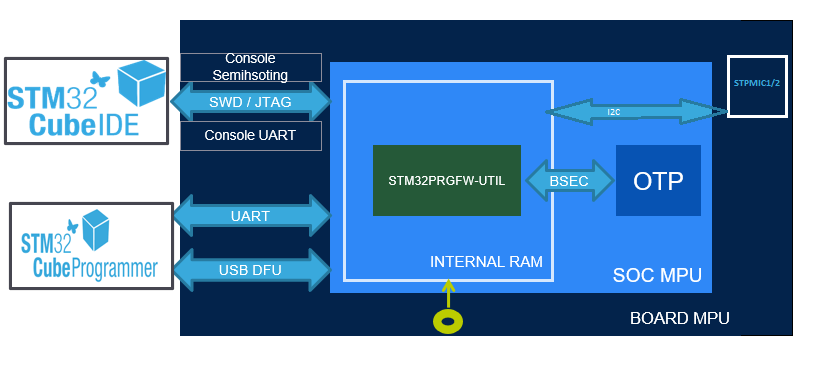

# STM32PRGFW-UTIL Firmware utility to manage One-Time Programmable (OTP) memories

## Warning

Please use **v1.0.2 tag and later** from now as an important fix done to avoid **bricking your device**.

## Project overview

**STM32PRGFW-UTIL** package  provides embedded SW applications to manage the One-Time Programmable (OTP) memories on **STM32MP13xx, STM3MP15xx  and STM32MP25xx devices** as described in the following [wiki page](https://wiki.st.com/stm32mpu/wiki/STM32CubeProgrammer_OTP_management)

It is **alternative** to the use of **U-Boot embedded SW package** described in article [How to fuse OTP↑](https://wiki.st.com/stm32mpu/wiki/STM32CubeProgrammer#How_to_fuse_STM32MP15x_OTP) but of course U-Boot services are still available.

This Utility could be usefull during bring-up phase to modify OTP when ecosystem Software (U-Boot in particular) is not ready yet. Indeed, this STM32PRGFW-UTIL firmware is **DDR independant** ; thus it is ready to use in most of cases for your own design.<br>
This package includes only source code required to support UART and USB DFU protocol  and OTP programming without more complex software, i.e. easy to adapt and improve for your own needs.

This package contains several "Modes" (CP_Serial_Boot, Console_SH..) that you can use with **Windows® or Linux®host PC**.<br> 
Please find below the more appropriated mode depending on your setup.<br> 
""How to"" for each mode is described below into this document.  

| Major Use cases / Setup                                                                                                                                                                             | CP_Serial_boot<br /> |         Console_SH         |                                             Console_UART                                             | CP_Dev_Boot |
| --------------------------------------------------------------------------------------------------------------------------------------------------------------------------------------------------- | :-----------------------------: | :------------------------: | :---------------------------------------------------------------------------------------------------: | :---------: |
| * Board with USB DFU or UART serial if<br />*[ STM32CubeProgrammer](https://wiki.st.com/stm32mpu/wiki/STM32CubeProgrammer_release_note) PC tool installed (v2.17.0 minimum)                     | &#10003;<br /> |                            |                                                                                                      |            |
| * Board with Debug port<br />* STM32CubeIDE 1.16.0 |                                | &#10003;<br /> |                                                                                                      |            |
| * Board with Debug port and 1 UART interface<br />* Semihosting (Terminal I/O through debug port)<br /> NOT available on PC                                                                       |                                |                            | &#10003;<br />Note: need to<br />modify UART<br />instance in source code <br />if different from ST boards |            |
| * Need to debug your own tool based on this package                                                                                                                                                |                                |                            |                                                                                                      |      &#10003;      |

The functional chart of the project describing all applications mentioned above:



## Repository structure

The **STM32PRGFW-UTIL** repository consists of the following repositories:

- **Drivers**: It contains HAL/LL component per serie and CMSIS Device source code. You can notice there is no BSP as this package is board independent.
- **Middlewares**: It contains OpenBL and USB device library core source code modified for MPU protocols.
- **Projects**: Project directory. It contains 1 STM32CubeIDE project per serie and 1 common project containing source code common to the different projects.

The project structure is described as below:


## How to Use CP_Serial_Boot

In this section, you will  use "Binary" directory  containing a STM32PRGFW-UTIL binary and a tsv file used by STM32CubeProgrammer.

### Hardware prerequisites

* Set boot pins according to table below 

| SOC | **[Serial Boot](https://wiki.st.com/stm32mpu/wiki/STM32_MPU_ROM_code_overview#Boot_device_selection)** Configuration |
|----|------------------- |
|MP15, MP13 | b000 (BOOT0/1/2 = OFF) |
| MP25 | b0000 (BOOT0/1/2/3 = OFF)   |
* If you want to use USB DFU interface

  * connect USB cable between PC and the board. PC shoud test USB DFU interface
* else if you want to use UART interface

  * connect UART cable between PC and the board
    * Note: could be STLink connector if Virtal COM port is connected on  the board like ST DK boards
  * **!!! NOTE: USB cable should not be connected if you want to use UART !!! - ROM CODE will USB DFU if both interface are available!**

### STM32CubeProgrammer GUI interface
### Note: to build binary for STM32MP25XX REV A, define CONFIG_STM32MP25X_REVA in preprocessor build for serial boot. Select the project, right click Properties>C/C++ Build>Settings> Build Steps, Do the change shown in image below. Apply the settings and Build. Place the generated binary in `<Your Directory Path>\`Projects\\`<STM32 device>`\Binary\\


### STM32CubeProgrammer GUI interface

Please Read STM32CubeProgrammer user manual for further details if needed

* Select Port (USB or UART) depending on the choice you made
* Click on Connect button - STM32CubeProgrammer is now connected to ROM Code
* Select TSV `<Your Directory Path>\`Projects\\`<STM32 device>`\Binary\FlashLayout_STM32PRGFW_UTIL.tsv
* Select Binary Path with Browse Button  `<Your Directory Path>\`Projects\\`<STM32 device>`\Binary\
* Click on Download - STM32CubeProgrammer is now connected to STM32PRGFW-UTIL firmware


* Click on OTP button to get OTP Panel


### STM32CubeProgrammer CLI interface

Please Read STM32CubeProgrammer user manual for further details if needed

* Go to the STM32CubeProgrammer binary directory   (i.e. STM32CubeProgrammer-212\bin)
* Open command prompt inside this bin directory
* Run this command to load the STM32PRGFW-UTIL binary in the embedded ram:<br>
  $STM32_Programmer_CLI.exe -c port=COM `<num>` -w `<Your Directory Path>\`Projects\\`<STM32 device>`\Binary\\FlashLayout_STM32PRGFW_UTIL.tsv
* Do not reset the board and execute command - Some command examples where UART interface (COM8) is used:<br>
  $STM32_Programmer_CLI.exe -c port=COM8 -otp displ<br>
  $STM32_Programmer_CLI.exe -c port=COM8 -otp write word=10 value=0x1<br>

  #### PMIC NVM Programming
* PMIC NVM can be programmed in serial boot mode using USB DFU or UART. 
  * Read the entire NVM partition by following command
  $STM32_Programmer_CLI -c port=usb1  -rp 0xf4 0x0 `<size of partition>` `<Your Directory Path>\`PMIC_NVM_read.bin
  here NVM data is written to PMIC_NVM_read.bin.
  * To read NVM using UART in serial boot mode replace usb1 with COM port appearing on the HOST.
  $STM32_Programmer_CLI -c port=COM`<num>`  -rp 0xf4 0x0 `<size of partition>` `<Your Directory Path>\`PMIC_NVM_read.bin
  * Backup it by creating a copy PMIC_NVM_write.bin
  * using hex editor modify PMIC_NVM_write.bin.
  * Write the NVM partion using below command for USB DFU.
  $STM32_Programmer_CLI -c port=usb1 -pmic "`<Your Directory Path>\`PMIC_NVM_write.bin"
  * To write NVM using UART in serial boot mode replace usb1 with COM port appearing on the HOST.
  $STM32_Programmer_CLI -c port=COM`<num>` -pmic "`<Your Directory Path>\`PMIC_NVM_write.bin"
##### Note: - For STPMIC1 `<size of partition>` is 8 Bytes, For STPMIC2 `<size of partition>` is 40 Bytes.
**Warning!!:- Care must be taken while modifying the NVM data. Invalid settings can cause board not to power up.**

## How to Use Console_SH

In this mode, you will use STM32CubeIDE and build config Console_SH

### Hardware prerequisites

* Set boot pins as per below table

| SOC | **[Engineering Boot/ Development Mode](https://wiki.st.com/stm32mpu/wiki/STM32_MPU_ROM_code_overview#Boot_device_selection) Configuration** <a name="devmode_bootspins"></a> |
|----|------------------- |
|MP15, MP13 | b100 (BOOT2 = ON, BOOT0/1=OFF) |
| MP25 | b0011 (BOOT2/3 = OFF, BOOT0/1=ON)   |


* Connect cable from Board/STLINK connector to the PC

### STM32CubeIDE Step by Step

* Build Project by selecting Console_SH build confiuration
* Setup Debug Configuration as below and in particular (in Startup tab):

```
monitor reset
monitor halt
mon arm semihosting enable
mon arm semihosting_redirect tcp 2323
```


* Run Debug configuration and Open TCP window with localhost and port number as described below (Window ->Show View-> Other-> TCP Console)
* Two consoles are present (1) OTP Console (2) PMIC Console
* Some command examples for OTP Console:

```
  $help
  $displ
  $displ word=10
  $write word=10 value=1
```
* Some command examples for PMIC Console:

```
  $help
  $displ
  $write addr=0x90 value=0x01
  $update
```


## How to Use Console_Uart

In this mode, you will use STM32CubeIDE and build config Console_UART

### Hardware prerequisites

* Set boot pins according to this [table](#devmode_bootspins) .
* Connect cable from Board/STLINK connector to the PC

### STM32CubeIDE Step by Step

* Depending your own board, you should change UART instance and GPIO into console_util.h file
  * By default it is the instance used on ST board (UART4  PD6&PD8 for STM32MP13xx  / UART4 PG11/PB2 for STM32MP15xx and USART2 PA4&PA8 for MP25xx)
* Build Project by selecting Console_UART build confiuration
* Setup Debug Configuration  and in particular (in Startup tab):

```
monitor reset
monitor halt
```

* Run Debug confiiguration
* Connect an hyperterminal and connect to COM port


## Release note

Details about the content of this release are available in the release note **Release_Notes.html**.

## Troubleshooting

**Caution**  : The issues are  **strictly limited**  to submit problems or suggestions related to the software delivered in this repository.

**For any other question**  related to the product, the hardware performance or characteristics, the tools, the environment, you can submit it to the  **ST Community**  on the STM32 MPUs related  [page](https://community.st.com/s/topic/0TO0X0000003u2AWAQ/stm32-mpus).
